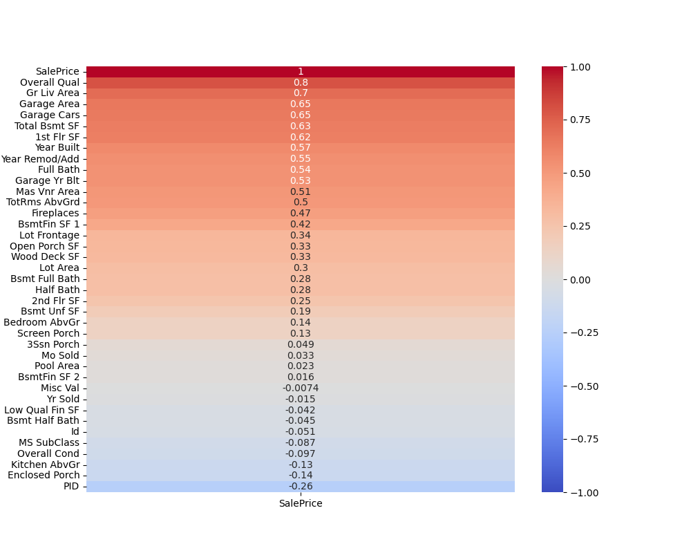
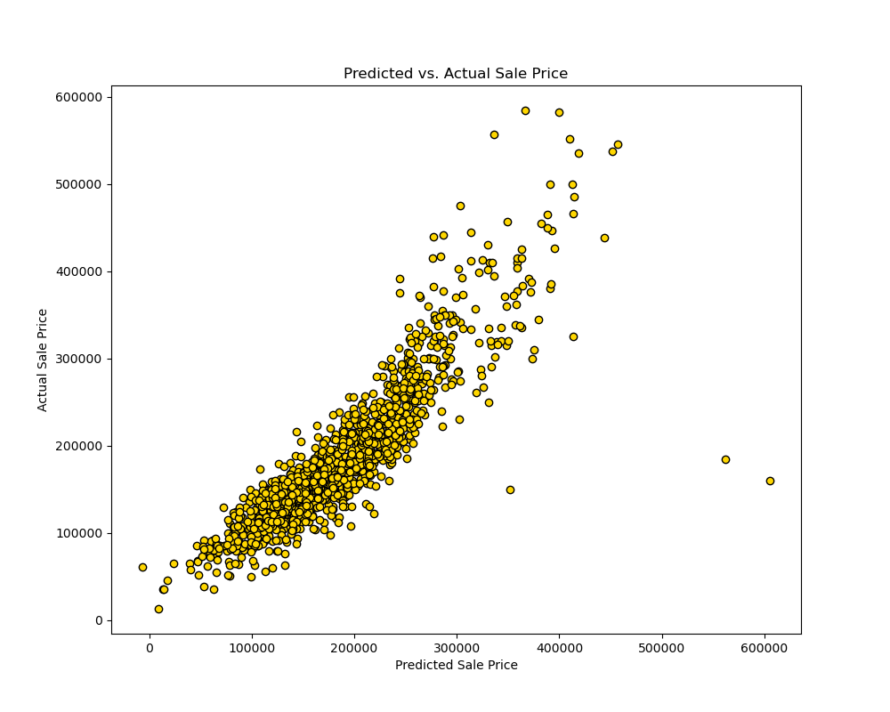

# Project 2 - Ames Housing Data and Kaggle Challenge

_Note: The reference to collaboration with Netflix's "Selling Sunset" is fictional and was solely intended for project-related purposes._


The Oppenheim twins, Jason and Brett Oppenheim, from the Netflix drama series, _'Selling Sunset'_, are launching their newest Oppenheim Group office in Ames, IA. This new office location is to be the setting for their newest _'Selling Sunset'_ spin off, _'Selling The Midwest'_. Effective property pricing is a pivotal aspect of real estate sales, balancing the desire for optimal profits with the need to avoid prolonged market stays. Various factors come into play when determining the right property value, including total square footage, bedroom and bathroom count, and for some, additional features such as a tennis court. Recognizing the importance of precision in pricing, Jason and Brett have enlisted my expertise to develop a predictive model. The goal is to accurately forecast home sales prices, aiming for a mean cross-validation score of at least 0.80, ensuring their clients receive the best possible listing prices in the competitive real estate market.


# File Directory

```
project-2
|__ code
|   |__ 01-EDA.ipynb   
|   |__ 02-Cleaning.ipynb   
|   |__ 03-Modeling.ipynb   
|__ data
|   |__ clean_test.csv
|   |__ clean_train.csv
|   |__ model_1_submission.csv
|   |__ model_2_submission.csv
|   |__ model_3_submission.csv
|   |__ sample_sub_reg.csv
|   |__ test.csv
|   |__ train.csv
|__ images
|   |__ numeric_heatmap.png
|   |__ Predicted_vs_Actual.png
|__ README.md
```


# Outside Research

Given that all the previously existing Oppenheim offices are situated in California, it's essential to first examine the commonalities and distinctions between California and Iowa's respective housing markets before delving into the model creation process.

Redfin, a real estate brokerage company that operates as an online platform, describes the IOWA (IA) housing market in the following way:

> "In August 2023, home prices in Iowa were up 5.4% compared to last year, selling for a median price of $232,000. On average, the number of homes sold was down 14.7% year over year and there were 3,678 homes sold in August this year, down 4,309 homes sold in August last year. The median days on the market was 22 days, down 8 year over year."

Redfin describes the California (CA) housing market in the following way:

> "In August 2023, home prices in California were up 5.0% compared to last year, selling for a median price of $794,300. On average, the number of homes sold was down 14.1% year over year and there were 25,068 homes sold in August this year, down 29,183 homes sold in August last year. The median days on the market was 27 days, down 5 year over year."

While the pricing disparity between Iowa (IA) and California (CA) is apparent, it's clear that these states share similarities in their real estate markets. In both regions, the inventory of available homes is decreasing at a comparable rate, mirroring the simultaneous increase in average home prices.

# Data Dictionary

The Ames Housing dataset and data dictionary can be found via [Kaggle's Ames Housing Challenge page](https://www.kaggle.com/competitions/dsi-910-ames-housing-challenge/data).

# Executive Summary

In the initial data cleaning process, I examined each column of the imported data while referencing the data dictionary to grasp the significance of each variable. Subsequently, I assessed and addressed missing data across 26 features. The data dictionary served as a guide in determining suitable replacement values for the gaps. Notably, the cleaning procedures implemented on the training data were consistently applied to the testing data as well.

Following the data cleaning process, I generated a correlation heatmap (displayed below) with values arranged based on their relationship with the sales price of a home. This served as a foundational reference for constructing my initial model. Additionally, I utilized a pairplot to delve into the relationships between sales price and the remaining 78 features, which provided the groundwork for subsequent model iterations.

<p align="center">
  
</p>

In my initial model, I included all variables from the heatmap above that exhibited a correlation of 0.5 or higher. This selection comprised a total of 11 features, which can be seen in the modeling notebook. Following a train-test split and the application of a linear regression model, the training set yielded an r2 value of 0.79, while the testing set produced a slightly higher value of 0.81. Upon fitting the model to the entire training set, the mean cross-validation score reached 0.7899—nearly meeting my target of 0.80 but not quite achieving it.

In my second model, I adopted a personal perspective, drawing from my recent experience as a first-time homebuyer. After sifting through the data library, I selected features that mirrored the characteristics my husband and I prioritized during our own house-hunting journey. Upon implementing a train-test split and applying a linear regression model to these chosen variables, the model attained a training r2 value of 0.79 and a testing r2 value of 0.81. When extending this model to the entire training set, the mean cross-validation score registered at 0.7927. Although this model showed a slight improvement over the first, it still fell short of reaching my targeted goal.

In constructing my third model, I opted to include all features from both the first and second models, as well as incorporate features from the pairplot in my EDA that hinted at potential positive correlations. This combination resulted in a set of 24 features for the basis of my model, which can be observed in the modeling notebook. Upon testing, this model exhibited a noteworthy training r2 value of 0.89 and a testing r2 value of 0.84. When extending the model to the entire training set, the mean cross-validation score reached a satisfactory 0.80, meeting the initial goal. This illustrates that 80% of the variance in sale price can be explained by the selection of these 24 features.

During the modeling process, I consistently assessed Mean Absolute Error (MAE) and Mean Squared Error (MSE) values for each of the three models. Notably, there was a consistent improvement observed from Model 1 to Model 3 across both metrics.

Upon closer examination of Model 3, illustrated in the figure below, a pronounced positive correlation emerges between the model's predicted sale prices and the actual recorded sale prices. Notably, this correlation weakens as the prices escalate. Nevertheless, given the median home sale price standing at $232,000, such nuances are deemed acceptable for this model.

<p align="center">
  
</p>


In conclusion, I was able to successfully deliver exactly what Jason and Bret asked for. I created a model that will predict sales price of a house based off of 24 variables commonly found in the houses around Ames, Iowa. The agents at the new Oppenheim Group office can use this model in two ways. When a client comes to them to list their house for sale, they can use this model to help them predict the best listing price and get their client the best sale. If a client is purchasing a home, the agent can use this model to evaluate if the listing price is over or underpriced and use that as a bargaining tool. This model should help make for a interesting season of “Selling the MidWest”. Thank you. 


In summary, I have successfully delivered exactly what Jason and Brett requested: a predictive model for determining the sales price of a house based on 24 variables commonly found in Ames, Iowa residences. The agents at the new Oppenheim Group office can leverage this model in two significant ways:
- When assisting a client in listing their house for sale, the model can aid in predicting the optimal listing price for a successful sale. 
- For clients looking to purchase a home, the model enables agents to evaluate whether a listing price is fair or needs negotiation, enhancing their bargaining strategy. 

This model promises to add an intriguing dimension to the upcoming season of "Selling the Midwest." Thank you.


# Sources

- [Redfin: Iowa Market](https://www.redfin.com/state/Iowa/housing-market)

- [Redfin: California Market](https://www.redfin.com/state/California/housing-market)